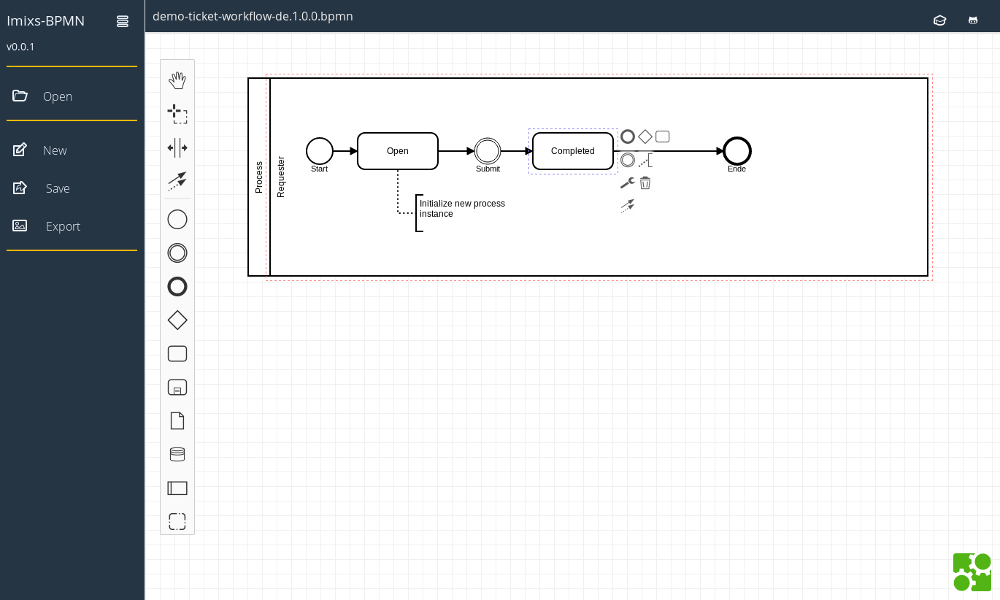

# imixs-bpmn.io

Imixs-BPMN.io Modeler is a web based BPMN modeler based on the [bpmn.io project](https://github.com/bpmn-io/bpmn-js). 

Test the online version: [https://bpmn.imixs.org](https://bpmn.imixs.org)

## Development

You need a [NodeJS](http://nodejs.org) development stack with [npm](https://npmjs.org) installed to build the project.

To install all project dependencies in your dev environment execute:

	$ cd main/
	$ npm install

To start the application execute

	$ npm start

To build the application into the `public` folder execute

	$ npm run all

	
# Docker

We provide an official Docker image [imixs/imixs-bpmn.io](https://hub.docker.com/repository/docker/imixs/imixs-bpmn.io)

Run the image with:

	$ docker run -p 8080:8080 imixs/imixs-bpmn.io
    
   
To build the docker image from sources on your dev environment run:

	$ docker build -t imixs/imixs-bpmn.io .
	
## Kubernetes

To deploy the modeler in a Kubernets cluster you can use the following yaml example:

	###################################################
	# Deplyoment Imixs-BPMN.io
	###################################################
	---
	kind: Deployment
	apiVersion: apps/v1
	metadata:
	  namespace: imixs-system
	  name: imixs-bpmn-io
	  labels: 
	    app: imixs-bpmn-io
	spec:
	  replicas: 1
	  selector:
	    matchLabels:
	      app: imixs-bpmn-io
	  template:
	    metadata:
	      labels:
	        app: imixs-bpmn-io
	    spec:
	      containers:
	      - name: imixs-bpmn-io
	        image: imixs/imixs-bpmn.io:latest
	        imagePullPolicy: Always
	        ports: 
	          - name: web
	            containerPort: 8080
	        # Memory Request and Limits
	        resources:
	          requests:
	            memory: "256Mi"
	          limits:
	            memory: "512Mi"
	      restartPolicy: Always
	
	###################################################
	# Service
	###################################################
	---
	kind: Service
	apiVersion: v1
	metadata:
	  name: imixs-bpmn-io
	  namespace: imixs-system
	spec:
	  ports:
	  - protocol: TCP
	    port: 8080
	    name: web
	  selector:
	    app: imixs-bpmn-io

Note: This example does not contain an Ingress configuration. 
	